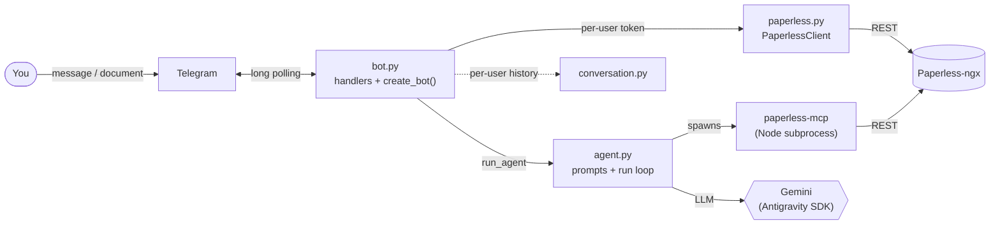
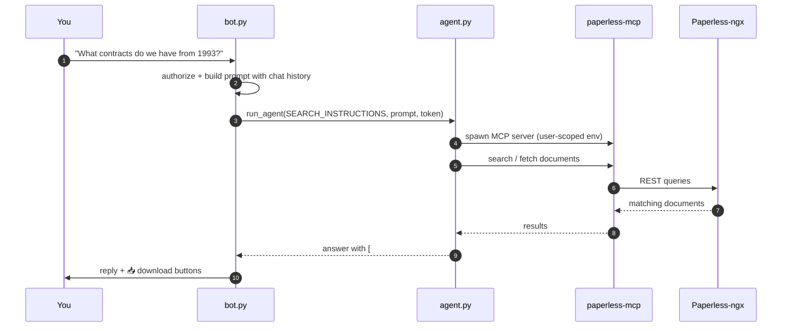
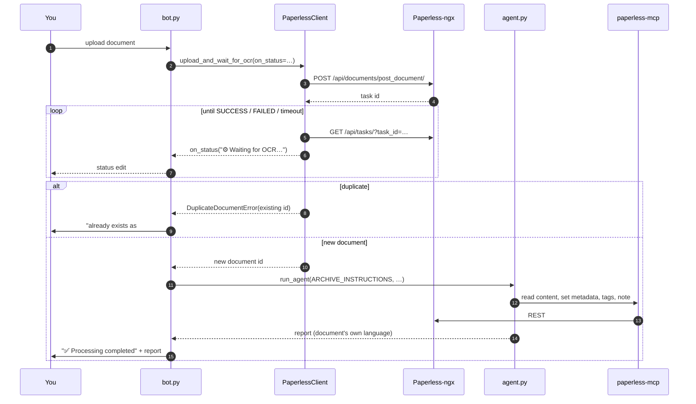

# Architecture

Paperless Genie is a small, single-process async application. A Telegram message
comes in, and depending on its type it either runs a **search** query or an
**archiving** workflow against your Paperless-ngx instance, driven by an AI agent
that calls Paperless through the Model Context Protocol (MCP).

## High-level flow

Every module has one job:

| Module | Responsibility |
| --- | --- |
| `config.py` | Load and validate environment configuration; map Telegram user IDs → Paperless tokens. |
| `bot.py` | Telegram handlers and the `create_bot()` factory; authorization; response formatting (chunking, download buttons). |
| `paperless.py` | `PaperlessClient` — all Paperless-ngx REST calls and the upload/OCR polling state machine. No Telegram dependency. |
| `agent.py` | System prompts, MCP server wiring, and the shared `run_agent()` loop. No Telegram dependency. |
| `conversation.py` | Bounded per-user chat history for search context. |

The split matters for two reasons: **security** — the MCP subprocess receives only
an allowlisted environment plus the requesting user's own token, never the bot
token, the Gemini key, or other users' tokens; and **testability** — `paperless.py`
and `agent.py` have no Telegram dependency, so the polling state machine and the
prompt contracts are unit-tested directly.

## Search query

A plain text message is treated as a natural-language query. The agent uses the
Paperless MCP tools to find documents and answers in the user's own language;
the bot turns any `[#ID]` markers in the reply into inline download buttons.

## Document archiving

Sending a PDF or photo triggers the archiving workflow. The upload and OCR wait
happen in Python (`PaperlessClient`), with live status edits in the chat; only
once the document exists does the agent enrich it.

## Deployment shape

The bot ships as a single Docker image (published to GHCR) that bundles Python
and Node.js — Node is needed because the Paperless MCP server is a Node package,
pinned and pre-installed into the image so message handling never fetches code at
runtime. It runs as an unprivileged user, holds no database of its own, and keeps
state only in memory (conversation history) for the lifetime of the process. See
the [Deployment Guide](deployment.md) for running it via Docker Compose or systemd.
