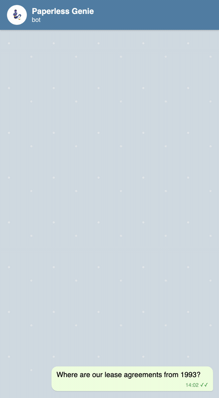

# Paperless Genie 🧞

Welcome to the **Paperless Genie** documentation!

`paperless-genie` is an intelligent, conversational AI Telegram bot for **Paperless-ngx** built using the **Google Antigravity SDK** (`google-antigravity`). It allows you to search and manage your document archive using natural language, directly from Telegram.

  
   
  <i>Illustrative demo — a mock-up chat with sample data, not a recording of a live instance.</i>

---

## Key Features

* **Natural Language Queries**: Search your documents by asking questions like *"Where is my passport?"* or *"List all lease agreements from 1992"*.
* **Smart PDF Archiving**: Send a PDF document via Telegram. The bot analyzes the document, extracts metadata, uploads it to Paperless-ngx, sets the tags/correspondent/date, and appends a detailed note.
* **Granular Multi-User Permissions**: Map Telegram User IDs to Paperless API Tokens so users only see and edit documents they have access to in your Paperless-ngx instance.
* **No Server Mount Required**: The bot interacts entirely via Paperless API and temporary folder paths, keeping your server clean.

---

## Quick Start

1. **Create a Telegram Bot**: Follow the [Telegram Bot Setup Guide](setup/telegram.md) to get a token.
2. **Get Paperless-ngx API Token**: Learn how to generate your API token in the [Paperless Setup Guide](setup/paperless.md).
3. **Configure Environment Variables**: Setup mappings and credentials in [Configuration Guide](setup/configuration.md).
4. **Deploy**: Choose to deploy using Docker Compose or systemd in the [Deployment Guide](deployment.md).
